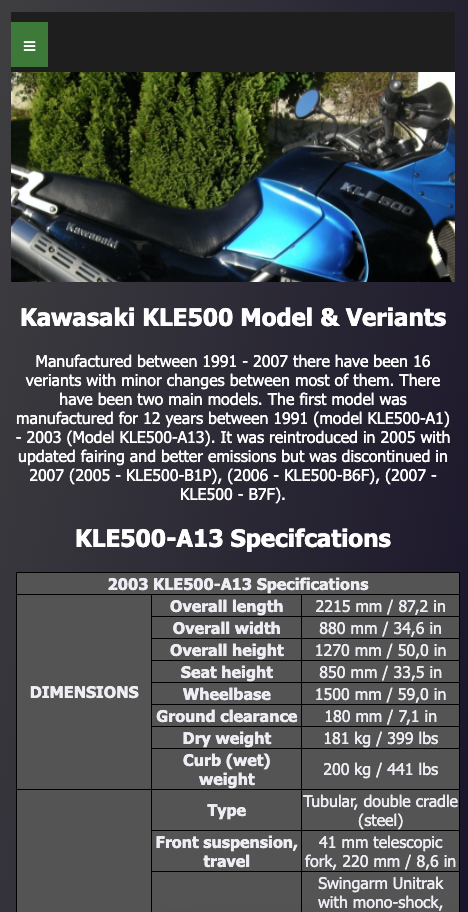

# My KLE 500

My KLE500 website is deddicated to the owenership of my motorbike.

The KLE500 is father a rare model of bike in europe and it was never available in the US.

Due to its rarity of the KLE and available onlin rescourse I felt there might be a need for a easilly accesable site for other motorcyle enthusiasts.

The the intention of the site it to be a place where anyone wanting to know more can find out some details the history and specification of the bike. The eventual aim would be to devlop the site further with a gallary, accessories page and links to relevant sites.

# Features 

There are three main sections for the site as follows:

## My KLE (home page)
- This section of the site has details about my specific bike, its history, how long I've owned it and my reasons why I purchased it.
There is also a article section detailing the diffeence between Adventure and Dual Sport categories of motorcycles.

## History & Specifications
- This section of the site has a breif history of the differnt models and varietes of bike and the specification of the model I own.  The idea being a good refence point for fellow motorcyclists.

## Contact & Feedback
- The is an area where people can contact me and ask questions or leave comment via a form.
There is also a quick survey for people to vote for there favourite adventure bike, voting for  which one they would purchase.

## The Footer
  - The footer section includes a link to my Linkedin page and my email address.

# Navigation Bar
- Featured on all three page there is fully responsive navigation bar,  which includes links to the Home page, History & Specs page and conact page. It is identical in each page to allow for easy navigation.
- When viewd a small screen/mobile device the menu is seen in the top left as a classic burger menu.

- This will allow the user to easily navigate from page to page across all devices without having to revert back to the previous page via the ‘back’ button. 

### Features Left to Implement
I intended to have additional sections to the site but have reduce the fueture set due to lack if time, Mostly due to the time taken on the navigation bar and device testing.

- GALLERY section with potographs of my bike. 
- Accesories & Parts 
- I originally planned to have tiling backround images on all pages but could not find any sutable stock images and it was taking up toomuch time.

## Testing 

The Website was tested severl differnt browser and plaforms I have available to test with. Navigation menu fistion, resizing, form data entry were all tested.

- MacOS Desktop 
	- Safari, Brave & Firefox
- iOS iPhone 
	- Safari, Brave & Firefox
- Linux 
	- Brave, Firefox & Vivaldi

On Mobile devices the navigation bar is reduced to a burger menu interface.  Also the three text boxs across the screen on the home page re-flow to be undeath each other rather than side-by-side seen on desktops browsers.

## Lighthouse

### Home Page

### Specifications Page

### Contact Page

### Validator Testing 

#### HTML - 
- Foud errors were detected and corrected.

https://webformatter.com/html

https://validator.w3.org/#validate_by_input

#### CSS
- Foud errors were detected most were corrected appart from two of them which I could bot resolve.

https://jigsaw.w3.org/css-validator

## Deployment

This section should describe the process you went through to deploy the project to a hosting platform (e.g. GitHub) 

The site was deployed to GitHub pages. The steps to deploy are as follows: 
  - In the GitHub repository, navigate to the Settings tab 
  - From the source section drop-down menu, select the Master Branch
  - Once the master branch has been selected, the page will be automatically refreshed with a detailed ribbon display to indicate the successful deployment. 

The live link can be found here - https://imorri.github.io/project1/index.html

## Credits
I used the several rescources to help me understnd the with the code I required, these included the following 

- Slack community
- code institute tutorials
- w3shools webside https://www.w3schools.com/ helped me understand and implement flex code.
- Code0box https://code-boxx.com/ the basis of the nav menu

### Content 
- All content was prodided by myself.

### Media
- Photo images used throughout the site are my own.
